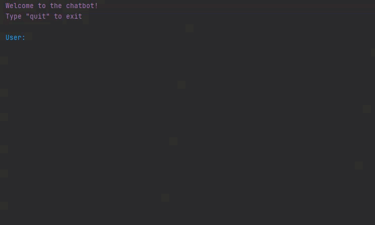

   

<h1 style="text-align:center; color:#01872A; font-size:30px;background:#daf2e1;border-radius: 20px;">Dialog based chatbot.</h1>

# Goal: Practice Encoder-Decoder structure and Natural Language Processing.
### Size: Medium (473 lines).

## 1. Problem definition

Create a chatbot that will learn on dialogs and will generate answers to 
user text word by word.

## 2. Data.
### Dataset for chatbot from Kaggle.
Source: https://www.kaggle.com/grafstor/simple-dialogs-for-chatbot/

Data contains asked questions and given answers appropriate to a question.

| №    | Feature       | Description|
|------|:-------------:|-------------------------------------------------------:|
|1     |**Question**   |Question asked in dialogue.                             |
|2     |**Answer**     |Answer given to the question.|

## 3. Evaluation

### The output is evaluated by human to check its consciousness.

## 4. Structure:

Contains <A href="https://nbviewer.org/github/sersonSerson/Projects/blob/master/NaturalLanguage/DialogBasedChatbot/DialogBasedChatbot.ipynb">one notebook</A> with main chapters:
1. Preprocessing and normalization.
2. Prepare data for Tensorflow.
3. Create encoder-decoder models.
4. Check the work of a model.

The chatbot itself is located in [Chatbot.py](Chatbot.py) file.

## 6. Results.
### Generated a chatbot that gives reasonable answers.
Sample: 

